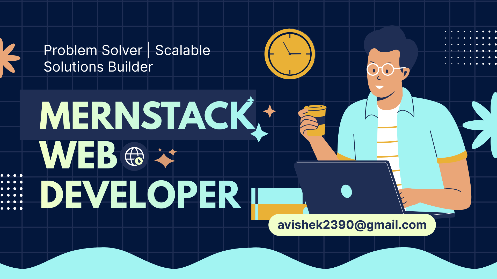

  

  

# 💫 About Me
👋 Hi, I'm Avishek    A professional Full-stack developer from Bangladesh, passionate about crafting pixel-perfect, responsive web applications using modern JavaScript frameworks ⚛️. I thrive on turning complex problems into clean, intuitive user experiences 💡 and bridging the gap between design and functionality 🎨. I'm constantly exploring new technologies to create faster, more scalable digital products 🚀, and my projects showcase a commitment to clean, maintainable code ✅.

## 🌐 Connect With Me
     

---
 

## 🚀 Current Activities

- 💻 Working with HTML5, CSS3, Tailwind CSS

- ⚙️ Experienced in JavaScript (ES6+)

- ⚛️ Building frontend applications using React

- 🔐 Implemented Firebase Authentication

- 🧠 Developing backend with Node.js and Express.js

- 🗄️ Managing data using MongoDB

- 🔄 Implemented CRUD operations

- 🔑 Used JWT authentication

- 🌍 Deployed projects on Netlify, Vercel and Render

- ✅ Completed Programming Hero Web Development Course

---
 

# 💻 Tech Stack
## Frontend
       

## Bakcend
   

## DataBase
    

## Authentication
   

## Tools & Deployment
       

---
 

# 📊 GitHub Stats

  
  &nbsp;&nbsp;&nbsp;&nbsp;
  

 

  

## 🏆 GitHub Trophies

### 🔝 Top Contributed Repo

---

<!-- ## 👀 Profile Views
  -->

  <b>Thanks for visiting! Let's build something amazing together! 🚀</b>

